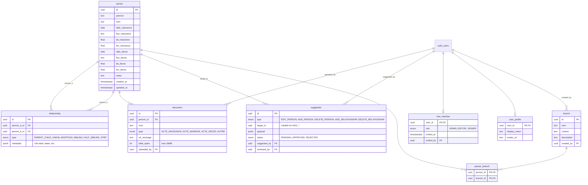

# Architecture

Vue d'ensemble technique du projet pour un dev qui découvre le code.

## Principes de design

- **Single-tree per deployment** — une instance = un seul arbre familial. Pas de `tree_id` partout. Pour avoir plusieurs arbres, on déploie plusieurs instances.
- **EU only** — Supabase hébergé en région EU (Frankfurt par défaut) pour RGPD. Pas de services US par défaut.
- **3 rôles** — `ADMIN` (full control), `EDITOR` (CRUD sans gestion membres), `VIEWER` (lecture + propose des suggestions).
- **RLS-first** — toute l'autorisation passe par les Row Level Security policies de Supabase. Le frontend ne peut pas bypass.
- **Server Actions Next.js** — pas d'API REST custom, on utilise les server actions pour toutes les mutations.

## Stack

```
Frontend            Backend                  Infra
─────────           ───────                  ──────
Next.js 16          Supabase Postgres        Vercel (hosting)
App Router          Supabase Auth            Supabase Cloud Frankfurt
TypeScript          Supabase Storage         GitHub Actions (CI)
Tailwind v4         Row Level Security
React 19            Server Actions
Leaflet             (no custom REST API)
pdf-lib
Vitest (359 tests)
```

## Structure des dossiers

```
src/
├── app/
│   ├── (landing)/              # / — landing publique avec waitlist
│   ├── (auth)/                 # /login, /signup, reset password
│   ├── (app)/                  # /tree — app authentifiée (protected)
│   ├── auth/callback/          # OAuth callback Supabase
│   ├── accept-invite/          # Acceptation invitations membres
│   └── privacy/                # Page mentions légales / RGPD
│
├── components/
│   ├── layout/                 # AppShell, Topbar, Sidebar, DetailPanel
│   ├── cosmos/                 # Vue orbitale animée (signature de l'app)
│   ├── views/
│   │   ├── sablier/            # Sablier Flow (cards + SVG connections)
│   │   ├── timeline/           # Timeline alternée avec dots
│   │   ├── carte/              # Carte Leaflet
│   │   └── eventail/           # Éventail (masquée par défaut)
│   ├── person/                 # PersonModal, LinkPersonForm, InlineLinkStep
│   ├── recherche/              # Formulaires Cerfa 3233 / 3236
│   ├── branch/                 # BranchModal, gestion branches
│   ├── search/                 # SearchOverlay (Cmd+K)
│   ├── suggestions/            # Panel suggestions (mode VIEWER)
│   ├── onboarding/             # CoachMark, FormPreviewCard
│   └── shared/                 # EmptyTreeState, OrphanPanel
│
├── server-actions/             # Mutations server-only
│   ├── auth.ts                 # login, signup, signout, resetPassword, signInWithGoogle
│   ├── persons.ts              # CRUD personnes
│   ├── relationships.ts        # CRUD liens
│   ├── branches.ts             # CRUD branches
│   ├── person_branch.ts        # Assignations
│   ├── documents.ts            # Upload PDF + signed URLs
│   ├── members.ts              # Invitations, rôles
│   ├── search.ts               # Search overlay
│   └── suggestions.ts          # CRUD suggestions VIEWER
│
├── lib/
│   ├── supabase/
│   │   ├── client.ts           # Client browser (anon key)
│   │   ├── server.ts           # Client server-side (anon key avec cookies)
│   │   ├── middleware.ts       # Refresh session dans middleware Next.js
│   │   └── admin.ts            # Client service_role (bypass RLS — ⚠️ critique)
│   ├── context/
│   │   └── tree-context.tsx    # Contexte React global avec persons/relationships/branches
│   ├── hooks/                  # useOnboarding, useScrollSelectedIntoView, etc.
│   ├── pdf-filler.ts           # Remplissage PDF Cerfa via pdf-lib
│   ├── spf-directory.ts        # Annuaire des 100 SPF français
│   ├── geocode.ts              # Geocoding lieux (Nominatim)
│   ├── cycle-detection.ts      # Détection cycles dans l'arbre
│   ├── branch-detection.ts     # Auto-détection branches familiales
│   ├── demandeur-profile.ts    # Profil demandeur Cerfa (localStorage)
│   └── ui/                     # selection-tokens, etc.
│
└── middleware.ts               # Middleware Next.js (refresh Supabase session)

supabase/
└── migrations/
    ├── 001_initial_schema.sql  # Tables + enums + indexes
    ├── 002_rls_policies.sql    # Row Level Security policies
    ├── 003_storage_bucket.sql  # Bucket "documents" + storage policies
    └── 004_suggestions.sql     # Table suggestion + RLS
```

## Modèle de données



### Conventions importantes

- **`PARENT_CHILD`** : `person_a` = parent, `person_b` = enfant (**toujours**)
- **`UNION`** : ordre des deux personnes non significatif
- **`relationship.metadata`** : JSON libre, contient typiquement `{ role: 'père' | 'grand-mère' | ... }` pour l'affichage UI
- **Person n'a pas d'`user_id`** : les personnes de l'arbre ne sont pas les utilisateurs de l'app
- **Auth via `auth.users`** (Supabase) : les `tree_member` et `user_profile` étendent ce table

## Sécurité — RLS policies

Toute l'autorisation est dans `supabase/migrations/002_rls_policies.sql` et `004_suggestions.sql`.

**Pattern général** :
- `SELECT` : autorisé si l'user est membre du tree (`EXISTS in tree_member`)
- `INSERT`/`UPDATE` : `ADMIN` ou `EDITOR`
- `DELETE` : `ADMIN` uniquement
- Exceptions documents/storage : insert par EDITOR+, delete par ADMIN, immutable (pas d'UPDATE)
- Exceptions suggestion : VIEWER peut insert/delete-own-pending, EDITOR+ review

**Fonction helper** :
```sql
current_user_role() RETURNS member_role
  -- SELECT role FROM tree_member WHERE user_id = auth.uid()
```

**⚠️ `src/lib/supabase/admin.ts`** utilise la `SUPABASE_SERVICE_ROLE_KEY` qui **bypass toutes les RLS**. À n'utiliser que dans des Server Actions qui ont déjà fait leur propre check d'autorisation. Jamais côté client.

## Flux clés

### 1. Auth

```
User → /login → server-action `login(formData)` 
              → supabase.auth.signInWithPassword
              → cookie HttpOnly set
              → redirect /tree
```

Le middleware (`src/middleware.ts`) refresh la session à chaque request.

### 2. Créer une personne

```
User → AppShell → "+" button → PersonModal step 1 (form)
                             → server-action `createPerson(formData)`
                             → INSERT person (RLS check : EDITOR+)
                             → return id
                             → PersonModal step 2 = InlineLinkStep (lier)
                             → server-action `createRelationship(formData)`
```

### 3. Suggestion (mode VIEWER)

```
VIEWER → DetailPanel → "Proposer une modification"
       → SuggestionModal → server-action `createSuggestion(...)`
       → INSERT suggestion status=PENDING
EDITOR → SuggestionsPanel → review → approve/reject
       → server-action `reviewSuggestion(...)`
       → UPDATE suggestion + apply the change via admin client
```

### 4. Recherche foncière (Cerfa)

```
User → Rechercher → choisit 3233 ou 3236
     → Formulaire3233Modal pré-rempli avec :
       - Données de la personne sélectionnée (nom, prénoms, dates)
       - Demandeur (localStorage via demandeur-profile.ts)
       - SPF auto-détecté depuis le lieu de naissance (spf-directory.ts)
     → "Générer PDF"
     → pdf-filler.ts (pdf-lib) remplit le PDF officiel dans public/forms/
     → Download
```

## Tests

```bash
npm run test:run    # 359 tests, ~5s
npm run test        # watch mode
npm run test:e2e    # Playwright (configuré, peu de scénarios pour l'instant)
```

Tests organisés par feature :
- `src/lib/__tests__/*` — pure functions (cycle-detection, branch-detection, pdf-filler, spf-directory)
- `src/components/.../__tests__/*` — components React (Testing Library)
- `src/server-actions/__tests__/*` — server actions (mocks Supabase)

## Décisions techniques importantes

| Décision | Rationale |
|---|---|
| Single-tree per deployment | Évite la complexité multi-tenant en V1, suffit pour 99% des cas familiaux |
| Server Actions vs API REST | Type-safe end-to-end, moins de code, pattern Next.js standard |
| Sablier Flow custom (pas ReactFlow) | Layout déterministe par algorithme, pas d'interaction drag |
| Cosmos = vue par défaut | Signature visuelle de l'app, fait office d'écran d'accueil |
| RLS-only authz | Single source of truth, impossible de bypass côté client |
| Suggestions séparées de la table cible | Audit trail + workflow de review |
| PDF only pour documents | Simplifie validation, signed URLs Supabase Storage (7j max) |
| Warm Light design system | Crème #f8f8f6, violets #7c3aed, cards blanches — défini dans `globals.css` |
| Pas de drag & drop dans Sablier | Layout auto évite l'incohérence visuelle |

## Conventions de code

- **Naming** : français pour les concepts métier (`prenom`, `nom`, `lieu_naissance`), anglais pour le tech (`createdAt`, `useEffect`)
- **Server actions** : préfixe verbe (`createPerson`, `updateRelationship`, `deletePersonBranch`)
- **Tests data** : prénoms génériques (Pierre, Paul, Marie) — **jamais de vraies données perso** (PII)
- **Tailwind** : pas de CSS custom sauf cas spécial (animations Cosmos, coach-marks)

## Pour aller plus loin

- Specs design détaillées : `docs/superpowers/specs/`
- Plans d'implémentation historiques : `docs/superpowers/plans/`
- Contexte projet : `docs/CONTEXT.md`
- Mapping Cerfa : `docs/superpowers/specs/2026-04-07-cerfa-field-mapping.md`
